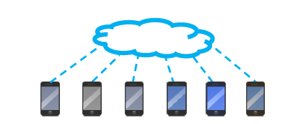

# 联邦学习

## 一、背景

​	随着数字化技术进入高速发展期，大数据和人工智能的爆发式发展，这一方面为传统行业带来了升级变革的新机遇，另一方面也给数据和网络安全带来了全新的挑战。关键挑战主要有两方面：数据孤岛和隐私安全。

​	当前，数据已成为比肩石油的基础性关键战略资源，正在颠覆全球社会的发展模式。2020 年4 月，中共中央、国务院发布《关于构建更加完善的要素市场化配置体制机制的意见》，将数据同土地、劳动力、资本、技术等传统生产要素并列，作为一种新型生产要素参与分配。作为释放要素价值的关键环节，数据资源的开放共享、交换流通成为重要趋势，其需求日益强烈。但是在大多数行业，数据都是以孤岛形式存在的。纵向来看，行业顶尖的巨头公司垄断了大量的数据信息，小公司往往很难得到这些数据，导致企业间的层级和差距不断拉大；横向来看，同一层级不同行业的公司，由于系统和业务的闭塞性与阻隔性，很难实现数据信息的交流与整合，联合建模需要跨越重重壁垒。

​	随着近年来数据安全事件频发，重视数据隐私和安全已经成为了世界性的趋势，各国都在不断地推出和加强完善对数据安全和隐私保护的相关法规。欧盟2018年正式施行《通用数据保护条例》（General Data Protection Regulation， GDPR）。美国加利福尼亚州也于2020 年1 月正式生效了《加利福尼亚州消费者隐私法》（California Consumer Privacy Act，CCPA）。在中国，全国信息安全标准委员会先后于2017年12月和2020年3月发布了两版《信息安全技术个人信息安全规范》（GB/T 35273-2017、GB/T 35273-2020），对个人信息收集、储存、使用做出了明确规定。此外，在2017年起实施的《中华人民共和国网络安全法》中也指出网络运营者不得泄露、篡改、毁坏其收集的个人信息，并且与第三方进行数据交易时需确保在合同中明确约定拟交易数据的范围和数据保护义务。

​	人工智能中的传统数据处理模型通常是简单的数据交互，其中一方收集数据并将其传输到另一方，而另一方负责整理和融合数据，最后由第三方获取集成数据并构建模型，以供其他各数据拥有方使用。这种方式严重违反了上述新数据法律法规。所以仅仅依靠传统方法难以解决数据不共享情况下的联合建模问题，联邦学习的提出为解决上述问题提供了一种方案。该技术在数据不共享的情况下联合建模。具体来讲，各个数据拥有者的自有数据不会离开本地，通过联邦系统中加密机制下的参数交换方式（不违反数据隐私保护法规的情况下）联合建立全局共享模型，建好的模型在各参与方只为本地的目标服务。

## 二、联邦学习定义

​		目前联邦学习有很多种定义的方式，虽然说法各有不同，但是核心思想却是一样的。本文采用2019年Google发表的《Advances and Open Problems in Federated Learning》中的定义，这篇论文是对联邦学习的综述，邀请了全球20+的机构和50+的联邦学习领域知名学者对来拿邦学习领域的发展和问题进行了总结，汇总了400多篇paper。

​		本文对联邦学习的定义是：

> Federated learning (FL) is a machine learning setting where many clients (e.g. mobile devices or whole organizations) collaboratively train a model under the orchestration of a central server (e.g. service provider), while keeping the training data decentralized.

​		翻译过来是：

> 联邦学习是一种机器学习范式，可以在一个中心服务器的协调下让多个客户端互相合作，即便在数据分散在客户端的情况下也可以得到一个完整的机器学习模型。

​		这里的客户端再不同的任务中可以指代不同的事物。比如在横向联邦学习的手机输入法预测下一个词语的任务中，客户端指代的是很多用户的手机；而在纵向联邦学习的多个医疗机构联合训练图像分割模型时，这里个客户端指代的是每一家参与训练的医疗机构。

​		在《Federated Machine Learning: Concept and Applications》中，杨强教授等人给出了联邦学习学术上的定义：

​		联邦学习面向的场景是分散式多用户${𝐹_1, … , 𝐹_𝑁}$，每个用户客户端拥有当前用户的数据集，${𝐷_1, … , 𝐷_𝑁}$表示这些用户的数据集。传统的深度学习将这些数据收集在一起，得到汇总数据集$𝐷 = 𝑈_1 ∪ … ∪𝑈_𝑁$，训练得到模型$𝑀_{SUM}$。联邦学习方法则是参与的用户共同训练一个模型$𝑀_{FED}$，同时用户数据$D_i$保留在本地，不对外传输。如果存在一个非负实数$𝛿$，使得$𝑀_{FED}$的模型精度$𝑉_{FED}$与 $𝑀_{SUM}$的模型精度$𝑉_{SUM}$如下不等式成立：
$$
|𝑉_{FED} − 𝑉_{SUM}| < 𝛿
$$
则称该联邦学习算法达到$𝛿$-精度损失。通常来说，$𝛿$可以是任意小的数，根据不同的应用场景选取不同的精度。

​		从上式我们可以得出结论：通过联邦学习在分布式数据源上构建的机器学习模型，这个联邦模型的性能将以$𝛿$的性能损失近似于数据集中情况下训练模型的性能。除此之外，联邦学习还包括以下特点：

- 有两个或两个以上的参与方联合构建机器学习模型。
- 在模型训练过程中，原始数据不能离开参与方本地。
- 训练模型的中间参数（模型参数，梯度信息等）以加密的方式在各参与方之间传输，并且任何一方不能根据中间参数反推出其他方的原始数据。
- 数据不动模型动，数据可用不可见

## 三、联邦学习分类

​	联邦学习最早由Google研究院在AISTATS 2017的论文《Communication-Efficient Learning of Deep Networks from Decentralized Data》中首次提出，目的是基于分布在多个移动设备上的数据训练模型。随后经过杨强老师团队的研究，按照数据在特征空间和样本ID空间的重叠关系不同，将联邦学习分为横向联邦学习（Horizontal Federated Learning），纵向联邦学习（Vertical Federated Learning）和联邦迁移学习（Federated Transfer Learning）。

### 3.1 横向联邦学习

​	横向联邦学习适用于参与方的数据特征重叠较多，但是数据样本ID不同的情况，如下图所示。它类似于在表格视图中将数据进行水平划分，因此横向联邦学习也被称为样本划分的联邦学习。简单来说，横向联邦学习扩充了数据的数量，相当于做了数据增广。例如服务于北京和上海的同一家银行，他们的商业模式是相同的，所以对应着相同的特征信息，都是记录客户的姓名，存款信息等。但是由于是不同地区，针对用户群体是不同的。

### 3.2 纵向联邦学习	

​	与横向联邦学习不同，纵向联邦学习适用于参与方有相同的样本ID，但是不同的特征维度。如下图所示，它类似于在表格视图中将视图垂直划分，所以也将纵向联邦学习称为特征划分的联邦学习。换句话说，纵向联邦学习则是在特征角度扩充了数据的维度。例如同一个地区的银行和电子商场，有着相同的客户群体，但是确拥有这些客户的不同特征信息，比如银行只有用户的收入和房产信息，而其他金融机构持有这个用户的账单信息。

### 3.3 联邦迁移学习

​	如下图所示，联邦迁移学习使用于参与方的样本ID和数据特征都很少重叠的情况。以两个参与方为例，其中一方代表源域，另一方代表目标域，我们在源域学习特征的分布，将源域的特征信息迁移到目标域中，但在这迁移过程中，本地数据也不会离开本地。例如，一家公司拥有丰富的图像信息，而另一家公司拥有文字等自然语言信息，图像和文字属予不同的特征维度空间。利用联邦迁移学习扩展自身的特征信息，提升模型的性能效果。

## 四、联邦学习架构

联邦学习按照特征和样本ID空间不同可以划分为三种类别。但无论是横向，纵向还是迁移学习，主要目的都是保证数据不出本地的前提下，如何有效协调各客户端共建模型。根据协调方式的不同，可以将联邦学习分为集中式拓扑架构和对等网络拓扑架构。

### 4.1 集中式拓扑架构

也称为客户端-服务器架构。在这种结构中，一般会存在一个中心服务器，服务器极可能是独立于各参与方的服务器，也可能是某一个特定的参与方。该中心服务器承担分发公私钥，加解密参数信息等工作，收集和传递参数信息并经过响应算法更新后返回各参与方，优势是易于设计和实现简单。

集中式拓扑架构的训练过程主要分为4个步骤：

1. 各参与方在本地计算模型梯度，并使用同态加密、差分隐私等技术对梯度信息进行掩码，将加密后的梯度信息发送给服务器。
2. 服务器进行安全聚合，例如使用基于同态加密的加权平均。
3. 服务器将聚合后的结果发送给各参与方。
4. 各参与方对收到的梯度信息解密，并使用解密后的梯度结果更新各自的模型参数。

上述步骤会持续更新迭代，直到损失函数收敛或者达到最大迭代次数为止。除了聚合梯度以外，还可以共享模型的参数。参与方在本地训练模型参数，并将模型参数发给服务器，服务器对收到的模型参数平均聚合，再将聚合后的参数发送给各参与方。两种方式各有优劣：

|      | 梯度平均                                           | 模型平均                                                     |
| ---- | -------------------------------------------------- | ------------------------------------------------------------ |
| 优势 | 每次迭代准确的梯度信息 收敛性有保证           | 不收SGD限制 不需要频繁的通信同步 可以忍受一定的更新缺失 |
| 缺点 | 需要频繁通信，加重通信负担 所以需要可靠的连接 | 不能保证收敛性 性能可能有一定损失                       |

​	

### 4.2 对等网络结构

不存在中心服务器，各参与方在联邦框架中的地位平等。由于集中式拓扑架构不可避免的药考虑中心计算方是否会泄露隐私或者遭受恶意攻击，所以相比之下对等架构更加安全。但这些架构设计困难，必须平等的对待个参与方且能够对所有参与方有效更新模型并提升性能。

由于对等网络架构没有服务器从中协调，所以需要各参与方提前规定发送和接受模型参数信息的顺序，主要有两种方式：

**循环通信**

各参与方按照一定顺序组成链状结构，第一个参与方将训练好的模型参数发送给下一个参与方，当前参与方收到模型后，利用本地数据更新模型，然后将更新后的模型发送给下一个参与方。直到模型的损失收敛。

**随机通信**

当前第k个参与方训练完成后，从其余的参与方随机选取一个作为下一个训练方，直接将模型参数发送给对方。重复上述过程，直到模型收敛。

## 五、联邦学习与分布式机器学习

### 5.1 分布式机器学习

分布式机器学习（Distributed Machine Learning，DML）是指利用多个计算节点进行机器学习或深度学习训练的算法和系统，旨在提高性能、保护隐私数据，并可以扩展至更大规模的训练数据和更大的模型。根据面向的场景不同，分布式机器学习也可以分为两类：面向扩展性的分布式学习和面向隐私保护的分布式学习。

面向扩展性的DML是为了解决不断增长的扩展性和计算需求问题的机器学习系统，比如想要训练BERT模型，他的预训练需要使用多个TPU且耗时数天，而且数据的集中存储需要耗费大量内存。当内存限制和算法复杂度成为主要障碍时，可以使用面向扩展性的DML。所以，面向扩展性的DML被广泛应用于具有横向联邦特点的场景中，将数据集横向切分，每一份训练数据的子集存储在不同的计算单元实体中。

面向隐私保护的DML主要目的是保护用户隐私和数据安全。在系统中，有多个参与方且每一方都拥有一些训练数据，需要使用DML技术利用每个参与方的训练数据，从而协同的训练机器学习模型。面向隐私保护的DML类似于纵向联邦学习的场景，不同参与方各自持有的训练具有相同的训练样本ID和不同的数据特征。

### 5.2 联邦学习与分布式机器学习的区别

#### 从解决什么问题角度看

分布式学习提出的目的是为了解决两个问题，一是内存有限，难以集中存储数据；二是模型复杂度太大，训练需要耗费大量时间。

而联邦学习的提出是由于数据分布在不同的设备或不同的机构之间，存在数据孤岛问题，另一方面是旨在隐私保护，在不泄露原始数据的情况下联合建模，需要更多保护隐私的措施。

#### 从解决问题的方案看

分布式学习常用的解决方案是数据并行和模型并行。**数据并行**是指利用不同的计算设备，通过使用同一个模型的多个副本，对多个训练数据分块进行处理，并定期通信交换最新的模型训练结果。这种方法能够很好的适配快速增长的训练数据规模。**模型并行**是指将一个模型分割为若干部分，然后将他们分别置于不同的计算节点中。模型并行的目的是避免内存容量限制。

联邦学习的解决方案是数据不动模型动，数据可用不可见。通过交互模型的参数信息来完成模型的更新过程，并且在计算和传输过程中使用多方安全计算技术，防止通过参数泄露原始数据。

#### 从数据的分布情况来看

对于一个在数据中心内的分布式学习，确保每一台机器上的数据都是独立同分布的，因此所有方的模型参数更新方式都是相同的。

而在联邦学习中，不同的参与方拥有的数据有着完全不同的分布，并且数据的大小也完全不同，即数据分布是非独立同分布的。两个参与方的模型参数更新方式也是不同的。

#### 从通信的角度看

分布式学习中，各计算节点能够快速通信，并且丢包率很低。

联邦学习中，客户和服务器间的通信依赖于现有的网络连接，例如，上行通信（客户端到服务端）通常比下行通信（服务端到客户端）要慢很多，尤其是使用移动网络进行连接时。除此之外，一些设备还存在断电，断网等失去网络连接的情况。

## 六、横向联邦学习

### 6.1 横向联邦场景

如果将数据想象成一个矩阵$D \in R^{n \times d}$，其中$n$代表样本个数，$d$代表样本维度。如果客户端$i$拥有的样本个数为$n_i$，样本维度为$d$，表示为$D_i \in R^{n_i \times d}$，即数据被横向分为了$n_1,n_2, \dots ,n_k$份分散到各个客户端，这就是横向联邦场景。

### 6.2 FedAvg

McMahan发表在AISTATS 2017的论文《Communication-Efficient Learning of Deep Networks from Decentralized Data》中，首次提出了联邦学习的概念，并且提出了FedAvg算法。

假设存在一个中心服务器server，和K个拥有私有数据的客户端clients，FedAvg采用的做法是：

训练流程如下：

> **第一步**，随机采样m个clients参与本轮训练，并由server下发初始化global model；
>
> **第二步**，clients在本地数据集上训练E轮，直到local model收敛，可以减少通信的次数；
>
> **第三步**，本轮参与方将各自的local model变化量（原始论文是直接发参数，但发参数变化量是一个更加广泛采用的做法）发送至server；
>
> **第四步**，server对这m个local model进行参数平均聚合，得到更新后的global model。

重复以上四步直至聚合模型收敛。[FedAvg算法实现参考](https://github.com/vaseline555/Federated-Averaging-PyTorch)

其实FedAvg可以看作是一个抽象的SGD算法过程。如果将每个client看作是一个“样本”，一轮通信对应着SGD的一次迭代，而m对应着SGD中Batch的大小，每个client发送给server的模型参数，则可以看作是当前这个“样本”在本次迭代中所产生的“梯度”。所以所有基于SGD改进的随机优化算法都可以应用到联邦学习上。

### 6.3 横向联邦学习研究方向

#### 6.3.1 模型训练问题

1. **客户端选择角度**

不同的客户端的网络速度、运算能力各不相同，每个客户端拥有的数据分布也是不平衡的，如果让所有的客户端都参与联邦学习的训练过程，将会有迭代落后的参与方出现，某些客户端长时间没有响应可能会导致整个系统无法完成联合训练。因此，需要考虑如何选择参与训练的客户端。可以分为随机选择或者优先选择方式：

FedAvg 算法是随机选择参与训练的客户端的。但在网络结构复杂以及数据非独立同分布的情况下，FedAvg 算法模型表现并不好。

[FedCS算法](https://arxiv.org/abs/1804.08333)设计了一种贪心算法的协议机制，以达到在联合训练的每一次更新中都选择模型迭代效率最高的客户端进行聚合更新，从而优化整个联邦学习算法的收敛效率。

2. **聚合方式**

在FedAvg 的算法中，聚合都是与模型的更新保持同步的。每一次更新，服务器都同步聚合模型参数，然后将聚合参数发送给每一个客户端。同步聚合时，服务器需要在接收到所有参与训练的客户端的参数之后才可以开始聚合。但是有的客户端运算传输快，有的客户端运算传输慢，为了避免出现通信迟滞现象，[FedAsync](https://arxiv.org/abs/1903.03934)采用异步聚合方式，服务器在接收到客户端的参数后，会通过当前训练的更新次数去设计加权聚合，从而解决non-IID 数据的异步聚合的算法收敛问题。

3. **Non-IID问题**

在现实生活中，客户端的数据往往都是非独立同分布的。非同分布：非同分布很容易理解，就是因为数据分布差异大。非独立：由于受到用户群体、地域关联等因素，这些设备的数据分布往往又是有关联的。

各个客户端的数据是非独立同分布的，这种情况下如何保证各个客户端训练的模型依旧可以有效地全局聚合？ 文献 [Federated Learning with Non-IID Data](https://arxiv.org/abs/1806.00582) 提出了一种共享数据的方法对NonIID下FedAvg进行改进，记为FedShare。[The Non-IID Data Quagmire of Decentralized Machine Learning](http://proceedings.mlr.press/v119/hsieh20a/hsieh20a.pdf) 探寻了几种可能的Normalization的方法，比如：Weight Normalization、Layer Normalization、Weight Renormalization、[Group Normalization](https://arxiv.org/abs/1803.08494)。实验发现Group Normalization（使归一化操作的计算不依赖batch size的大小）在NonIID下性能降低的最少，是最理想的Normalization方法。

如果能聚合出好的模型，如何将其部署下发到数据分布差异很大的客户端，即模型个性化问题？ 文献 [Survey of Personalization Techniques for Federated Learning](https://arxiv.org/pdf/2003.08673) 中指出：为了解决数据异构和NonIID数据所带来的挑战，对于全局模型global model的个性化变的越来越重要。大部分的个性化技术通常包括两个步骤。（1）利用各节点协作的方式学习一个global全局模型 ；（2）利用每个节点的隐私数据对global全局模型进行个性化定制。

#### 6.3.2 隐私泄露问题

联邦学习通过梯度聚合模型，但是发表在NIPS19上的一篇论文[Deep Leakage from Gradients](https://arxiv.org/abs/1906.08935)指出可以根据梯度信息还原训练数据。因此直接通过梯度聚合是不安全的行为，我们可以通过一些密码学方法保护联邦学习中的用户隐私和数据安全。如下图所示，各个客户端在上传梯度参数前，先用加法同态加密技术加密梯度，然后再上传，由服务器进行安全聚合。

除了同态加密技术，还可以使用秘密共享技术安全聚合，以及Google PAM方案。

#### 6.3.3 通信问题

1. **少传几次**

在联邦学习系统中，可以让更多的计算在本地进行，从而减少通信的次数。比如FedAvg算法，通过增加每个客户端在本地更新迭代的轮数，直到本地模型收敛才进行聚合操作，可以有效的减少通信次数。考虑到各客户端的数据和运算能力是不均衡的，如果每一次参数更新时，不同的参与方要参与的运算次数都统一的话，导致客户端的计算资源不能充分利用。为了优化这种情况，FedProx算法动态地更新不同客户端每一轮需要本地计算的轮数，使得算法更适合Non-IID场景。

2. **单次少传**

除了减少通信的次数外，我们还可以通过减少每次通信的参数量来解决通信问题。在常见的方法就是模型压缩，比如采用参数量化或者压缩编码的方式减少每一次更新的参数总量。其次还可以通过结构化更新的方式减少单次通信参数量，结构化更新是指通过提前定义上传模型参数的矩阵结构来上传模型，这样可以减少一些冗余的参数信息。

#### 6.3.4 安全问题

根据系统对敌手的容忍程度，安全模型可以分为半诚实安全模型(semi—honest model)和恶意安全模型(malicious model)。

**半诚实模型(honest but curious adversary, HbC)：**敌手会按照协议规定进行运算，但试图通过协议中得到的信息挖掘其他参与方的隐私数据，该模型保证用户隐私信息不被敌手获得．

**恶意模型（malicious adversary, Mal）：**敌手不会遵守约定执行协议，会以错误的协议执行结果推断信息，恶意攻击行为也可以是任意的不可推理的。该模型中用户隐私数据不会被敌手获得，且不会因为敌手的恶意行为导致协议错误运行。

**隐蔽敌手模型（covert adversary）：**是一种安全性介于半诚实模型和恶意模型之间的更符合真实场景的模型，由于担心恶意行为被协议检测出来并受到惩罚，隐蔽敌手使其恶意行为混淆在正常行为中，只能以一定的概率被检测到。

在训练过程中，攻击方式可以概括为以下几类：（1）数据投毒：恶意客户端利用”脏数据“用来训练全局模型；（2）模型投毒：恶意方在将更新后的模型发送到中央服务器进行聚合之前对其进行修改，破坏全局模型训练；（3）后门攻击：攻击者意图让模型对具有某个特定特征的数据做出错误的判断，但模型不会对真实任务产生影响。因为真实任务的准确性不会受到影响，所以识别后门攻击既困难又耗时。

#### 6.3.5 区块链与联邦学习

虽然联邦学习（FL）最近已成为一种分布式人工智能方法，通过协调多个设备共同训练模型，而无需共享原始数据以增强隐私和节省网络资源。但联邦学习仍然存在一些问题：

1. 用户需要完全信任中心服务器，但在现实的无线网络中并不总是能做到这一点。
2. 其次如果中心服务器收到攻击而导致故障，就会造成整个联邦系统中断。

区块链凭借其去中心化的特性，在提高联邦系统的安全性方面有很大的潜力：

1. 使用分散的区块链可以消除FL训练中对中央服务器的需求。相反，一个共享的不可变账本用于聚合全局模型，并将全局更新分发给各客户端，以便在设备上进行直接计算。模型聚合的非集中化不仅降低了单点故障的风险，从而提高了训练可靠性，而且还降低了在全局模型聚合中对中央服务器造成的负担，尤其是在联邦系统具有多个客户端时。
2. 模型更新被写入不可变的块中，用于在训练期间在客户端之间进行信息交换，可以判断客户端是否存在恶意攻击，当遭受恶意攻击时，根据区块链记录的信息进行核验，便可以找出具体是哪一方收到攻击，进而采取相应的措施。将区块复制到整个网络还允许所有客户端验证和跟踪训练进度，以确保联邦区块链系统的高度信任和透明度。
3. 引入奖励机制，并吸引更多移动用户参与模型训练，从而提高移动边缘网络的可扩展性。

## 七、纵向联邦学习

### 7.1 纵向联邦场景

如果将数据想象成一个矩阵$D \in R^{n \times d}$，其中$n$代表样本个数，$d$代表样本维度。如果客户端$i$拥有的样本个数为$n$，样本维度为$d_i$，表示为$D_i \in R^{n \times d_i}$，即数据被纵向切分为了$d_1,d_2, \dots ,d_k$份分散到各个客户端，这就是纵向联邦场景。

### 7.2 纵向联邦架构

纵向联邦学习的典型场景是不同的机构之间想要联合建模，例如几个银行和金融公司想要共同建立评分卡模型，各自都有自己的数据，并且用户相同，但是拥有的用户特征不同，其中只有一方拥有标签信息。由于要遵守数据安全法规或者保持专有数据的竞争优势，各参与方都不想共享自己的数据给对方，这时就可以利用纵向联邦学习来解决这个问题。

如下图所示，纵向联邦学习的训练过程一般由两部分组成：首先是对不同参与方的数据进行隐私对齐；然后基于对齐后的数据执行加密的模型训练过程。

#### 7.2.1 数据对齐

由于不同机构的用户群体不同，联邦系统根据用户的ID进行数据对齐，在此过程中，各参与方不会暴露各自的除交集之外的原始数据。

#### 7.2.2 模型训练步骤

找到个参与方之间交集的数据后，就可以利用这些交集数据共同训练机器学习模型了。训练过程可以分为以下几个步骤：

> 步骤一：协调中C生成密钥对，并将公钥发送给参与方A，参与方B；
>
> 步骤二：A方和B方对中间计算结果进行加密和交换，中间结果用来帮助计算梯度和损失值；
>
> 步骤三：A方和B方计算加密梯度并分别加入掩码，然后将加密的结果发送给C方；
>
> 步骤四：C方对梯度和损失信息解密，并将结果返回给A方和B方。A方和B方接触梯度信息熵的掩码，并根据梯度信息更新模型参数。

上述步骤是有第三方协调者参与的情况，在实际应用中，更多的是不需要可信第三方参与。此时需要由A方和B方分别生成密钥对。

### 7.3 纵向联邦学习研究方向

目前联邦学习正处于快速发展的阶段，是解决企业和机构当前数据合规难题的方案之一。但是在安全和计算性能等方面仍存在很大挑战。

#### 7.3.1 安全方面

对于设计联邦学习算法的设计人员来说，如何设计出安全可靠的联邦学习算法是一大挑战。因为联邦学习和多方安全计算结合的算法协议差异较大，难以形成统一的算法安全基础。而且目前提出的算法都是基于安全假设，在此基础上进行算法的设计，比如假设第三方是可信的，参与方完全按照协议流程参与训练等，但十几种这些假设都不一定能成立。并且算法协议也不存在绝对安全。

对于使用联邦学习产品的参与方来说，如果让参与方相信产品的安全性也是一大挑战。目前联邦学习产品都是以自证清白的方式来证明安全性，行业内没有一个全面系统的评估体系。所以需要制定相关标准来帮助产品规范，还可以通过检测手段来验证产品的安全性。

#### 7.3.2 性能方面

联邦学习算法通常需要和密码学技术结合保证建模过程的安全性，比明文计算付出更大的计算和存储代价，由此带来的是性能瓶颈问题。性能由算法协议、计算流程、系统架构、数据规模、软硬件环境、网络带宽等多种因素共同决定。

在算法优化层面，一些常用方式包括：算法加速，尽可能的降低子模块耦合度，对算法流程重新进行深度编排；通信加速，最大程度的减少节点间通信次数及通信量；代码加速，使用更底层的语言（例如C/C++)来构建基础算子，通过调整字符串和循环体等方式来降低计算开销等。

在硬件加速层面，通过新的密码学技术和算法协议，结合硬件加速技术（如GPU、FPGA、ASIC加速）和专有算法实现硬件来加速计算量较大的环节和步骤，也能够有效提高性能。

## 八、联邦学习应用场景

### 8.1 联合营销：跨行业数据融合重构用户画像

当前营销业务进入到智能时代，应用于营销的数据维度不断丰富，应用场景也不断增加。然而，用户画像的数据往往是相互割裂的，只有通过整合多机构间多维度的数据才能构建更立体的用户画像，实现资源的优势互补、开拓市场广度和挖掘市场深度的营销目的。利用隐私计算可以帮助机构在不输出原始数据的基础上共享各自的用户数据进行营销模型计算，根据建模结果制订营销策略，实现双赢的联合营销目的。

在构建营销模型中，可通过联邦学习技术，对交互的标签、特征、梯度等数据进行等密码学处理，保证密文接收方或外部第三方无法恢复明文，直接基于密文进行计算并获得正确的计算结果，从而达到各参与方无需共享数据资源即可实现联合构建营销模型，进一步丰富用户画像，从而进行精准营销。

银行机构利用联邦学习技术，可对运营商、政务、征信等数据实现应用场景所需的价值融合，从而为用户提供聚合金融服务。

保险公司将用户基本信息、购买保险、出险赔付和电商、航旅等其他合作方的消费、出行、行为偏好等数据进行安全融合。

通过匿踪查询技术可信地获取客户的黑名单、消费能力、画像标签等信息，用于识别消费者的潜在风险等应用。

电信运营商通过融合金融机构数据在共有的用户群中找到对理财产品、保险产品有兴趣的用户群，筛选找到更精准的目标用户进行营销，提升交叉销售效果，获取更多的新客。

互联网公司利用自身拥有的大量用户行为信息和基础画像数据，与广告数据方拥有的深度转化链路数据（如付费信息）进行安全求交，并通过多方安全计算或联邦学习技术联合训练、建模、优化广告模型效果。在游戏、金融、教育、电商行业的广告应用案例中都能提升广告投放效果和用户体验。

### 8.2 金融领域：联合风控

金融行业是最早应用信息技术的产业之一，从上世纪80年代的ATM机到近年的开放银行，金融行业已经收集、产生、积累了大量的数据。同时，金融行业也是能够最大化利用数据价值的行业之一，从个人征信到公司估值，从价值投资到技术分析，金融行业想提供高效服务、获取用户价值，离不开对数据的合理使用。

当今，金融行业在使用数据时面临数据孤岛和数据隐私保护两大问题。这两个问题的解决方案在传统的技术方案中看似是相互矛盾的，但通过联邦学习，金融行业可以做到在保护数据安全和个人隐私的前提下，解决数据孤岛问题，充分发挥数据价值。

比如在构建风控模型时，一方面可通过融合多个金融机构数据，解决单个金融机构样本量有限的问题，形成在相关场景中的全局认知，提升模型精准度；另一方面，可以综合利用金融机构同其他行业数据，在各方原始特征不出域的前提下建立风控模型，形成对业务的多维度认识，提升风控质量。

此外，通过打破数据孤岛，聚合各方数据，隐私计算还可以在发现多头借贷、信贷风控、保险定价、精准营销等多个金融行业的细分领域发挥重要价值。

### 8.3 医疗领域：联合建模

医疗数据具有隐私性极强的特点，医疗数据的安全常常关乎人们的生命财产安全。目前，海量的医疗数据分散在各个孤立的医疗机构中，传统的方法下，数据安全和隐私保护的要求使得这些数据无法聚合起来，而单个医疗机构的数据样本量又不足以支撑大规模的模型训练，难以实现数据价值。

例如在疫情防控中，通过联邦学习保障个人数据的安全性，对高危人群进行筛选疫情传播仿真分析，通过防控筛查模型精准筛查高风险易感人群，构建潜在传染的关系网结合病患信息，快速追溯传染路径方向和传播源。

在基因分析中，要依赖大量隐私数据，可利用联邦学习技术在原始基因数据不出库的基础上，实现基因数据的安全共享，进行全基因组的联合计算及关联分析等，在隐私保护的前提下挖掘多样的基因资源。

在临床医学研究中，引入联邦学习技术，能够进一步实现不同医疗机构的化验检查数据联合建模，通过联合建模、共享模型，即使是病例量较小的医院，也能获得效果较好的模型。模型可用于辅助医生诊断，在减轻医生工作负担的同时，帮助医生提高诊断准确率。

隐私计算技术在医疗领域的应用，将以极低的成本促进优质医疗资源下沉，提升医疗资源稀缺地区和基层医疗机构的医疗服务能力和水平。

### 8.4 电子政务：促进政务数据安全共享开放

联邦学习技术不仅在企业、机构间大放异彩，而且在政务领域逐渐得到了充分应用。

在政务数据共享上，政务公共数据分布在各部门，通过联邦学习技术搭建政务公共数据密文开放共享交换平台，打通跨域数据的应用价值链，使得数据基于业务应用需要在各业务条线之间，安全地共享和流通，实现数据安全共享融合而不泄密。

在政务数据开放上，政府机构建设保护各方隐私安全的公共数据开放平台，使用联邦学习技术融合政府数据和社会、企业数据进行安全计算，联合统计，联合建模，实现数据融合价值，可以广泛应用在信用评估、健康医疗、营销设计等众多领域，让政府部门掌握的数据在安全保护前提下，最大限度造福社会。

### 8.5 边缘计算和物联网：

移动边缘计算（Mobile edge computing，MEC）用来处理来自无处不在的移动设备的大量数据，以便在人工智能（AI）的帮助下实现智能服务。传统上，AI技术通常需要在单个实体中进行集中数据收集和训练，但是MEC服务器由于数据隐私问题和大数据量通信开销无法计算。

随着智能手机和移动互联网的普及应用，大量数据产生在设备的边缘端，移动边缘计算使计算发生在本地设备，而不需要将隐私数据发送到云端。而联邦学习作为边缘计算的操作系统，提供了一种各方协作与共享的协议规范，它能够让边缘设备在不向云端设备发送源数据的情况下，合作训练出一个最优的全局机器学习模型。未来，随着物联网的进一步发展，人工智能和边缘计算将朝着一体化的方向大步向前。

### 8.6 智慧城市

随着人工智能、物联网和5G技术的发展，智慧城市的概念已经跃然纸上。然而，智慧城市涉及安防、交通、环保、文旅等各个行业，其业务生态虽然纷繁复杂，但功能本质上都是通过对数据的不同处理形式来实现的。通过交通出行数据、物联网数据、公安数据、水电燃气数据、互联网数据等的融合利用，智慧城市可以提高一个城市的公共管理、公共服务、公共安全水平，而各类数据的融合利用则离不开安全的数据共享。

联邦学习的异构数据处理能力能够帮助人们创造迅速响应市民需求的智慧城市，解决数据“孤岛”问题，同时基于智慧城市构建的机器学习模型为企业提供个性化服务带来了更多的机遇。

## 参考文献

[^1]:The official GDPR website[A/OL].EU Commission (2020-03-07). https://ec.europa.eu/commission/priorities/justice-and-fundamental-rights/data-protection/2018-reform-eu-data-protection-rules_en.
[^2]:California consumer privacy act. bill no. 375 privacy：personalinformation： businesses. https://leginfo.legislature.ca.gov.2018:06-28
[^3]:新华网. (受权发布)中华人民共和国网络安全法[OL].[2020-02-17]. http://www.xinhuanet.com/politics/2016-11/07/c_1119867015.html
[^4]:王健宗，孔令炜，黄章成，陈霖捷，刘懿，何安珣，肖京．联邦学习算法综述．大数据. https://kns.cnki.net/kcms/detail/10.1321.G2.20200821.1708.004.html
[^5]:[Advances and Open Problems in Federated Learning](https://arxiv.org/abs/1912.04977)
[^6]:[Federated Machine Learning: Concept and Applications](https://dl.acm.org/citation.cfm?id=3298981)
[^7]:杨强,刘洋,程勇,等.联邦学习[M].电子工业出版社:北京,2020:2
[^8]:杨强,黄安埠,刘洋,陈天健. 联邦学习实战.电子工业出版社. 北京. 2021.05
[^9]:[A survey on security and privacy of federated learning](https://www.sciencedirect.com/science/article/pii/S0167739X20329848)
[^10]:[Federated Learning Challenges, Methods, and Future Directions](https://arxiv.org/abs/1908.07873)
