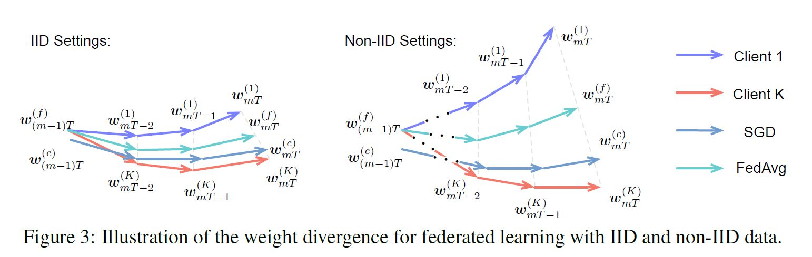
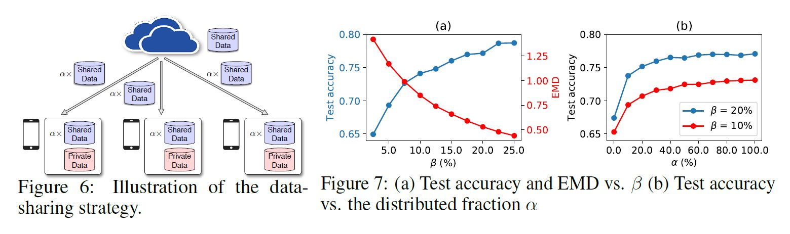
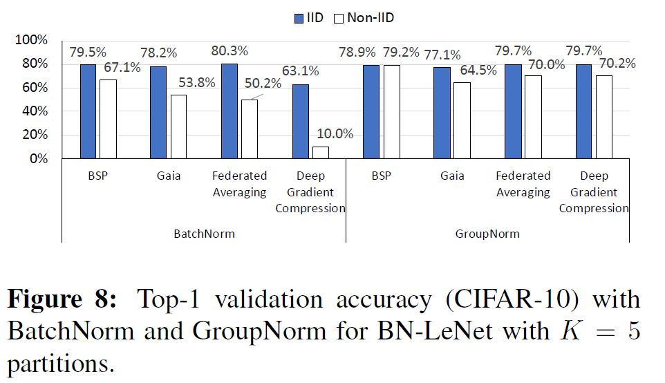
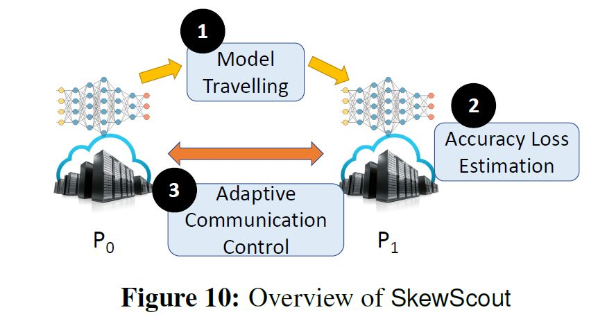
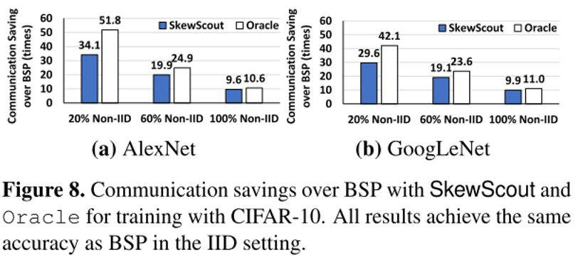

#  Federated Learning - Non-IID

##  1. Non-IID概述

### 1.1 产生原因

在传统机器学习中，数据分布在同一个机器上，并且假设数据是从同一个分布中独立地采样的，即数据独立同分布（Independently Identically Distribution, IID）。

后来随着数据量的急剧暴长，大数据时代需要分布式算法进行并行计算，此时分布式优化（Distributed Optimization）主要做的事情是利用多台机器对大数据或者大模型进行并行计算，包括模型并行（Model Parallelism）和数据并行（Data Parallelism）两种基本范式。但此时仍只是为了加速计算，各个客户端上的数据仍然是IID的。

但是随着物联网（Internet of Things, IoT）设备的大规模使用，如何协同数以万计的设备及其私有数据进行训练模型则是联邦学习做的事情，此时由于设备归属于某个用户、企业、场景，因此其数据分布往往是差异极其大的，即数据非独立同分布（Non-IID）

- 非同分布：非同分布很容易理解，就是因为数据分布差异大
- 非独立：由于受到用户群体、地域关联等因素，这些设备的数据分布往往又是有关联的

### 1.2 分类

在文献 [Advances and Open Problems in Federated Learning](https://arxiv.org/abs/1912.04977) 中，作者以分类任务为例，数据包括图像和类别标签，分别用和表示。针对客户端之间的分布差异，将Non-IID分为下面五种情况：

- **Feature Distribution Skew (Covariate Shift)**：特征分布偏移，具体指的是.svg)不一致，但是.svg)一致。比如：不同人的字迹差异很大，客户端A写的“联邦学习”和客户端B写的“联邦学习”都应该被识别为“联邦学习”。
- **Label Distribution Skew (Prior Probability Shift)**：标签分布偏移，具体指的是.svg)不一致，但是.svg)一致。例如：标签的分布因客户的不同而不同；袋鼠只在澳大利亚内；一个人的脸只出现在世界范围内的某一地区
- **Same Label, Different Features (Concept Shift 1)**：一样的标签，但却有了不同的表现，具体指的是.svg)不一致，但是.svg)一致。这个需要和第一种FDS区分开来，第一种强调特征变化，但是即便特征不同，依旧可以被识别为相同的类别。而这里指的是，类别集合一致，但是认知的表现形式却不一致。比如：判断一幅人物图像的美丑；唐朝人以胖为美，而现代人以瘦为美
- **Same Feature, Different Labels (Concept Shift 2)**：一样的图像，但却有了不同的标签，具体指的是.svg)不一致，但是.svg)一致。例如：同一张图像，客户端A将图像分类为美，而客户端B将图像分类为丑
- **Quantity Skew**：客户端上样本数目差异巨大

以上五种分布差异并不是严格割裂开来的，在实际场景中往往包含多种分布不一致情形。另外，不同的分布不一致情形具有不同的处理方法，因此可以在实际任务中判断场景数据和哪一种情况比较接近，然后再进行寻求相应的方法处理。

##  2. Non-IID导致的问题

###  2. 1 为什么Non-IID情况下聚合的模型性能变差？

文献 [Federated Learning with Non-IID Data](https://arxiv.org/abs/1806.00582) 中对这个问题进行了解释：

下图展示了联邦学习任务中梯度更新的过程：

其中：左边图是IID情形，右边图是NonIID情形。这里面主要比较了使用SGD在数据集中时更新以及使用FedAvg在联邦学习场景下更新的过程

-  }.svg)指的是使用SGD进行数据中心化（Data Centralized）更新的权重变化，也就是在所有数据上进行更新
- },...,w^{(k)}.svg)  指的是客户端1-K上的权重变化
- }.svg)是},...,w^{(k)}.svg)聚合之后的结果，也就是FedAvg中服务器全局聚合之后的权重结果

从图中可以看出：

- 在IID设置下，一开始T}^{(f)}.svg)是在第m-1个全局模型聚合的结果，然后发送到各个客户端，各个客户端进行根据样本更新，由于SGD是随机梯度下降，采样batch size的不确定性，各个客户端的更新并不是完全同向的，更新了T步之后，客户端1上得到了权重}.svg)，客户端K上得到了}.svg)，最后服务器上聚合的结果是}.svg)，可以看到和}.svg)得比较近
- 然而在NonIID情形里面，各个客户端上权重的更新方向差异很大，导致最后FedAvg聚合的结果是}.svg)，和SGD的权重}.svg)离得比较远。

FedAvg聚合得到的权重和SGD更新得到的权重的差异被定义为Weight Divergence，该项越小则说明FedAvg聚合的结果和SGD在集中数据上更新的结果接近。具体定义为：
### 2.2 Non-IID导致的问题

- 问题一：各个客户端的数据是非独立同分布的，这种情况下如何保证各个客户端训练的模型依旧可以有效地全局聚合？ 

- 问题二：如果能聚合出好的模型，如何将其部署下发到数据分布差异很大的客户端，即模型个性化问题？ 

##  3. Non-IID解决方案

### 3.1 针对全局聚合

####   方法一：**[Federated Learning with Non-IID Data](https://arxiv.org/abs/1806.00582) ，Yue Zhao，Vikas Chanra；San Jose, CA；arXiv 2018**

文献 [Federated Learning with Non-IID Data](https://arxiv.org/abs/1806.00582) 提出了一种共享数据的方法对NonIID下FedAvg进行改进，记为FedShare。FedShare的做法是留出一个数据集G，该数据集是均匀分布的，所有数据的总数是D，其大小和所有数据的权重比例为。首先，该数据集G被用来预训练全局模型，然后下发的时候也会下发一部分全局数据到各个客户端，数目为，客户端同时在这部分全局数据和私有数据上训练。

FedShare的示意图和其性能图如下，为NonIID下FedAvg的性能，但是随着增大，性能逐渐变好。在共享所有数据5%的情况下，Cifar10上可以提升将近30%的性能

####  方法二：[The Non-IID Data Quagmire of Decentralized Machine Learning](http://proceedings.mlr.press/v119/hsieh20a/hsieh20a.pdf) , Kevin Hsieh， Amar Phanishayee， Onur Mutlu， Phillip B. Gibbons；Microsoft Research；PMLR 2020

- 实验证明：基于Batch Normalization的方法更容易失败，基于Group Normalization的会好很多

Batch Normalization可以使得优化目标更平坦，以及使用大的学习率，减少了之前使用大学习率会震荡的问题。Batch Normalization的基本做法是对一批样本求平均值和方差的统计量，记为 ，然后对这批样本做标准化，即，有的时候还会加入进行缩放和偏置，其中是可以学习的参数。而是通过数据统计出来的，如果Batch Size太小或者不同客户端数据是NonIID的，那么不同客户端上的这些统计量就会差异特别大。

文章探寻了几种可能的Normalization的方法，比如：Weight Normalization、Layer Normalization、Weight Renormalization、[Group Normalization](https://arxiv.org/abs/1803.08494)。关于这几种Normalization的细节和区别这里不再介绍，但是实验发现Group Normalization（**使归一化操作的计算不依赖batch size的大小**）在NonIID下性能降低的最少，是最理想的Normalization方法。

本文得出结论：在NonIID设置下，好的Normalization需要满足两个条件：1）不依赖于Batch计算，因为每个Batch的采样和客户端的数据分布极其相关；2）性能比较好。

- 提出了一种调节通信频率的方法**SkewScout**，可以根据客户端上分布偏移的程度调整相应的通信频率

主要包括三个部分：

1. 模型转移，模型从客户端P0发送到客户端P1；

2. 估计精度损失：统计客户端P1上性能的变化Accuracy，当然也不一定是Accuracy Loss，对比的是使用接收的模型的性能和原本自身模型性能的差异；

3. 根据性能变化调控通信算法的超参数（如Gaia中的threshold，FedAvg中的本地训练次数等），以此来调节通信频率；

实验结果：

### 3.2 针对模型个性化

文献 [Survey of Personalization Techniques for Federated Learning](https://arxiv.org/pdf/2003.08673) 中指出：为了解决数据异构和NonIID数据所带来的挑战，对于全局模型global model的个性化变的越来越重要。大部分的个性化技术通常包括两个步骤。

1. 利用各节点协作的方式学习一个global全局模型 
2. 利用每个节点的隐私数据对global全局模型进行个性化定制

#### **具体方法**

1. **Cluster**

- [Data selection for federated learning with relevant and irrelevant data at clients](https://arxiv.org/pdf/2001.08300),  Tiffany Tuor, Shiqiang Wang, Bong Jun Ko, Changchang Liu, Kin K. Leung;  arXiv 2020

  本地模型中的数据可能只有一部分的样本和特定的任务相关，而且有的样本都是无关样本，会影响模型的训练。Tuor提出了一种方法，其中使用基于小型benchmark构建的相关性模型来区分相关样本和不相关样本，然后在联邦学习过程中仅使用相关样本

- [Three approaches for personalization with applications to federated learning](https://arxiv.org/pdf/2002.10619), Yishay Mansour, Mehryar Mohri, Jae Ro, Ananda Theertha Suresh, arXiv 2020

  将客户端进行聚类，将相似的客户端分组在一起，并且为每个组训练一个单独的模型

2. **Transfer Learning**

   迁移学习可以使得深度学习模型利用在解决一个问题上所获得的的能力来解决另一个相关问题。Schneider和Vlachos在[Mass personalization of deep learning](https://arxiv.org/pdf/1909.02803)讨论了使用迁移学习来实现在非联邦环境下的模型个性化。迁移学习也同样被应用于联邦环境中。Wang在[Federated evaluation of on-device personalization](https://arxiv.org/pdf/1910.10252)提出将训练后的全局模型的某些或者全部参数将根据本地数据进行重新学习。在前面的引用中提供了其理论依据。通过使用经过训练的全局模型的参数来初始化对本地数据的训练，迁移学习能够利用全局模型所提取的知识，而不需要从头开始学习。必须要注意，不能对本地数据进行太多轮次的finetune。

3. **Multi-task Learning**

   在多任务学习当中，模型可以通过联合学习来利用任务之间的共性和差异从而同时解决多个相关任务。Smith在[Federated multi-task learning](https://arxiv.org/pdf/1705.10467)文中展示了多任务学习是一种天然的选择去构建个性化的联邦模型，并开发了MOCHA算法。然而在联邦环境中使用多任务学习有一个缺点是，由于它会为每个任务生成一个模型，因此所有节点都必须参与每一轮的训练.

4. **Meta Learning**

   元学习涉及到多个学习任务的训练，以生成能够快速适应的模型，该模型可以通过少量的训练样本就能够快速拟合学习解决新任务。Finn提出了模型无关的元学习算法(MAML)，该算法与使用梯度下降法训练的任何模型都兼容。MAML建立了适用于多个任务的内部表示，因此针对新任务，对于顶层的微调可以产生比较好的结果。

   [Improving federated learning personalization via model agnostic meta learning](https://arxiv.org/pdf/1909.12488)指出可以将联邦学习的过程看做是meta training，而personalization过程可以看做是meta testing过程。那么FedAvg算法与Reptile非常相似。同时作者观察到，仔细的微调可以产生准确率高的全局模型，并且比较容易个性化，但是单纯的根据全局模型的准确率来优化模型会损失模型后续的个性化能力。联邦学习的其他个性化方法将全局模型的生成和个性化能力视作两个独立的过程，Jiang提出了一种改进的FedAVG算法，该算法可以同时获得更好的全局模型和更好的个性化模型。

   Fallah在[Personalized federated learning: A meta-learning approach](https://arxiv.org/pdf/2002.07948)，文中提出的标准联邦学习问题的新公式结合了MAML，并试图找出一个全局模型，该模型在每个节点针对其自身的损失函数进行更新后均表现良好。此外，他们提出了Per-FedAvg算法来解决上述问题。Khodak在[Adaptive gradient-based meta-learning methods](https://arxiv.org/pdf/1906.02717)中提出了ARUBA，并通过将其应用于FedAVG证明了性能的提高。chen在[Federated meta-learning with fast convergence and efficient communication](https://arxiv.org/pdf/1802.07876)提出了一个用于构建个性化推荐模型的联邦元学习框架，其中算法和模型都已参数化并且需要优化。

5. **Knowledge Distillation**

   知识蒸馏通过让学生模仿老师，将大型教师网络的知识提取到较小的学生网络中。过拟合在个性化过程中造成了巨大的阻碍，尤其是对于本地数据集较小的节点。[Salvaging federated learning by local adaptation](https://arxiv.org/pdf/2002.04758)提出通过将全局模型看做是老师，而节点的个性化模型看做是学生，可以缓解过拟合的现象。Li提出了[Fedmd:Heterogenous federated learning via model distillation](https://arxiv.org/pdf/1910.03581)，一种基于知识蒸馏和迁移学习的联邦学习框架能够让节点独立的设计他们的网络并利用节点的隐私数据和全局的公共数据集。

6. **Base+Personalization Layers**

   在传统的联邦学习环境下，数据分布与多个参与训练的设备中。为了缓解这种数据异构性所带来的不利影响，[Federated learning with personalization layers](https://arxiv.org/pdf/1912.00818)提出了FedPer网络，这种网络的基础网络层由FedAVG进行训练得到，而顶层（个性化层）则通过本地节点的变体梯度下降法训练得到。迁移学习的方式，是将所有网络层在全局数据上训练，然后在本地节点数据上，对某些层或者所有层进行再训练。而FedPer算法是分别在全局数据上训练基础网络层，在本地数据上训练个性化层。

7. **Mixture of Global and Local Models**

   [Federated learning of a mixture of global and local models](https://arxiv.org/pdf/2002.05516)提出了一种新的问题形式，试图在全局模型和局部模型之间寻找平衡。每个节点不学习单个全局模型，而是学习全局模型和他自己的局部模型的混合体。为了解决这个问题，作者提出了一种梯度下降法的变体LLGD(Loopless Local Gradient Descent)。与FedAvg不同的是，这种方法仅采取步骤求平均，因为FedAvg的方法可能过于激进。
